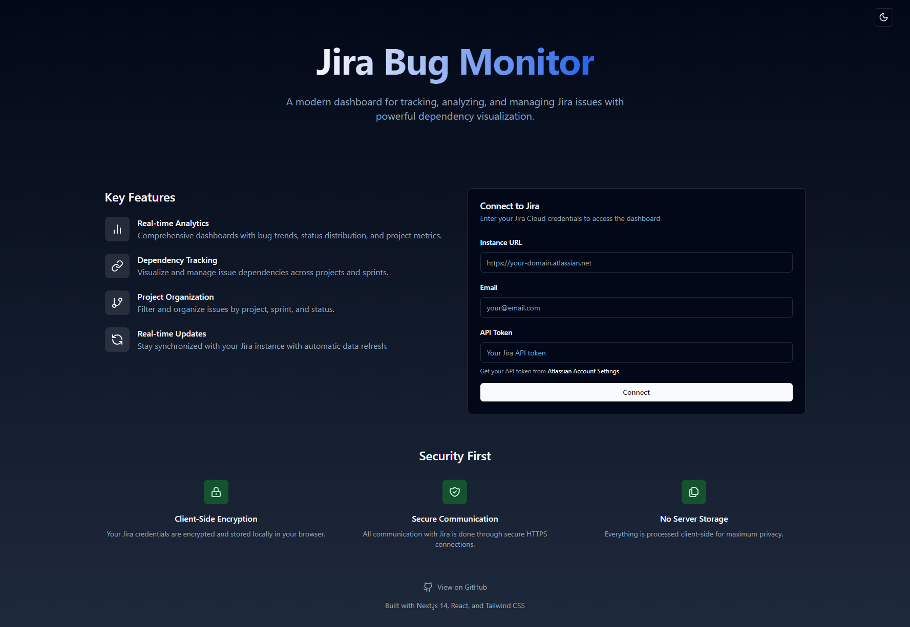

# Jira Bug Monitor

A modern, real-time dashboard for monitoring and analyzing bugs in Jira projects. Built with Next.js 14, React, and Tailwind CSS.



## Features

- 📊 Real-time bug tracking and visualization
- 🔍 Advanced filtering by project and issue type
- 📈 Comprehensive analytics including:
  - Bug status distribution
  - Project-wise bug distribution
  - Bug trends over time
  - Activity heatmap
- 🔐 Secure authentication with Jira API tokens
- 🌓 Dark/Light mode support
- 📱 Responsive design
- 🔄 Real-time data synchronization

## Tech Stack

- **Framework**: Next.js 14 with App Router
- **Language**: TypeScript
- **Styling**: Tailwind CSS
- **UI Components**: shadcn/ui
- **Charts**: Recharts
- **State Management**: React Query
- **Authentication**: Jira API Token
- **API Integration**: REST API

## Prerequisites

- Node.js 18.x or later
- A Jira Cloud instance
- Jira API token ([How to get one](https://support.atlassian.com/atlassian-account/docs/manage-api-tokens-for-your-atlassian-account/))

## Getting Started

1. Clone the repository:
```bash
git clone https://github.com/yourusername/jira-bug-monitor.git
cd jira-bug-monitor
```

2. Install dependencies:
```bash
npm install
# or
yarn install
```

3. Create a `.env.local` file in the root directory:
```bash
NEXT_PUBLIC_APP_URL=http://localhost:3000
```

4. Run the development server:
```bash
npm run dev
# or
yarn dev
```

5. Open [http://localhost:3000](http://localhost:3000) in your browser.

## Configuration

### Jira Setup

1. Generate an API token from your Atlassian account
2. When logging in to the dashboard, you'll need:
   - Your Jira instance URL (e.g., `https://your-domain.atlassian.net`)
   - Your email address
   - Your API token

## Deployment

### Deploy to Vercel

The easiest way to deploy the application is using Vercel:

1. Fork this repository
2. Create a new project on Vercel
3. Connect your forked repository
4. Deploy

[](https://vercel.com/new/clone?repository-url=https://github.com/yourusername/jira-bug-monitor)

### Self-hosted Deployment

1. Build the application:
```bash
npm run build
# or
yarn build
```

2. Start the production server:
```bash
npm run start
# or
yarn start
```

## Project Structure

- `/app` - Next.js 14 app directory containing routes and layouts
- `/components` - Reusable React components
- `/lib` - Utility functions and helpers
- `/types` - TypeScript type definitions
- `/utils` - Helper functions for API calls and data processing

## Contributing

Contributions are welcome! Please feel free to submit a Pull Request.

1. Fork the repository
2. Create your feature branch (`git checkout -b feature/AmazingFeature`)
3. Commit your changes (`git commit -m 'Add some AmazingFeature'`)
4. Push to the branch (`git push origin feature/AmazingFeature`)
5. Open a Pull Request

## License

This project is licensed under the MIT License - see the [LICENSE](LICENSE) file for details.

## Acknowledgments

- [shadcn/ui](https://ui.shadcn.com/) for the beautiful UI components
- [Recharts](https://recharts.org/) for the charting library
- [Next.js](https://nextjs.org/) team for the amazing framework

## Support

If you encounter any issues or have questions, please file an issue on the GitHub repository.